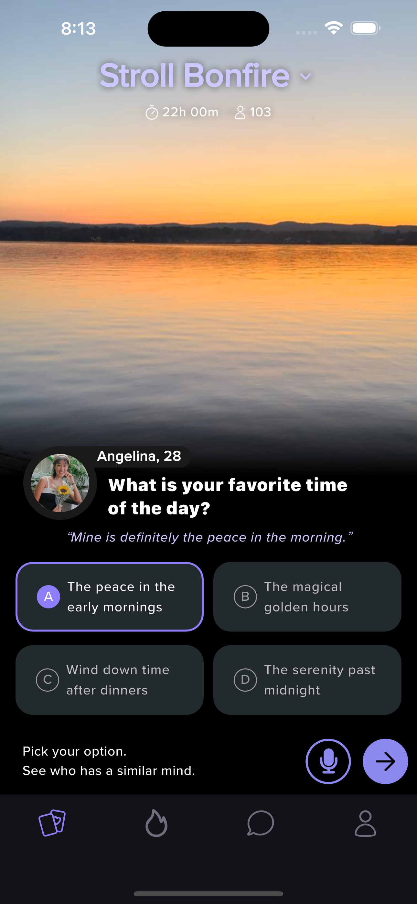
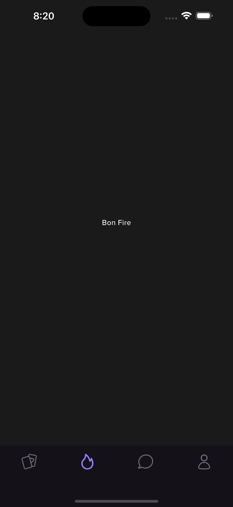
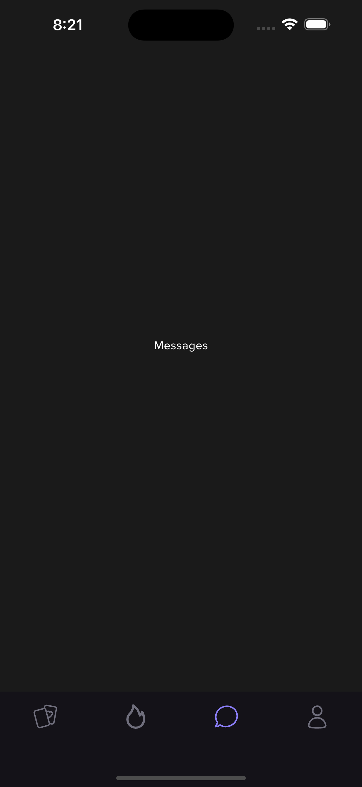

# Code Test Name: STROLL UI TEST
A UI test asked to be done by Stroll HR team

## I. Project Setup Instructions:

1. **Flutter Setup:**
    - Ensure you have Flutter installed. If not, follow the instructions [Link](https://flutter.dev/docs/get-started/install) to set up Flutter on your laptop or desktop.
    - Clone this repository to your local laptop:
      ```
      git clone <repository_url>
      ```
    - Navigate to the project directory in your terminal.
    - Or you can use the url in your Github Desktop [Link](https://github.com/joemdjossou/stroll_ui_test.git)
  
  2. **Running the Application:**
    - Here we go! Once Flutter and Firebase are set up, run the application on a simulator or a physical device using:
      ```
      flutter run
      ```

## II. Assumptions Made During Development:

- **Design feedback:** The development process was based on the expectation that the Figma design would be adhered to strictly.

- **App Interactivity:** It was anticipated that the majority of the application content would be dynamic.

- **Design and functionalities:** The functionalities are much more important than the user interface, but without a good interface the users will not even check the functionalities, so a balance between the two was found.

## III. Challenges Faced and Overcoming Them:

- None faced so far....

## IV. Additional Features or Improvements:

- **Boosted performance:** Performance optimization techniques were implemented to ensure the application operates smoothly and responsively across various devices and platforms.

---

## App Review

### App Local Image

<div style="display: flex; justify-content: center;">
    
    
    
</div>


Above are images showcasing the app.
